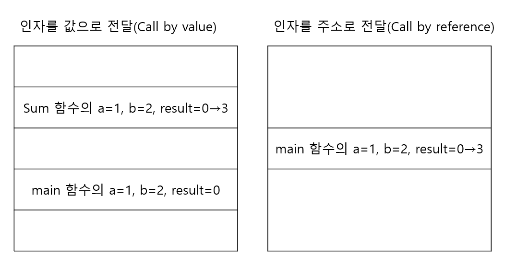

# C작점 5주차 학습일지

## 배열 활용 문제 풀이

 배열을 한 번 더 복습하는 차원에서 배열과 반복문을 이용하는 문제를 만들어서 해결해보기로 했다. 문제는 다음과 같다.
```
"abcde"라는 배열을 만들고 오른쪽(R) 또는 왼쪽(L)을 입력받은 뒤 숫자를 입력받아서
입력받은 방향으로 입력받은 숫자의 크기만큼 이동시킨 문자열을 출력하여라.
```
 예를 들면, 오른쪽으로 두 칸 이동시키라는 의미로 “R 2”를 입력하면 문자열 “deabc”를 출력하고, 왼쪽으로 한 칸 이동시키라는 의미로 “L 1”을 입력하면 문자열 “bcdea”를 출력한다.

```c
int move;
char direction, str[] = "abcde";

scanf(“%c %d”, &direction, &move);

if(direction == 'L'){
	move = 5 - move;
}
```

 먼저 기본적으로 앞서 배웠던 scanf 함수로 방향와 이동 칸수를 입력받는다. 그리고 왼쪽과 오른쪽에 따라 옮기는 방향을 결정하는데 아래의 예시처럼 왼쪽의 경우를 오른쪽의 경우로 바꾸어 주는 방법과 조건문을 써서 왼쪽의 경우와 오른쪽의 경우를 나누어 코드를 짜는 방법이 있다. 전자의 방법이 훨씬 짧고 간단하므로 대부분이 추천했다. 사실 생각해보면, 어느 곳에서 방향을 결정하냐에 차이지 원리에서는 두 방법이 같다는 것을 알 수 있다. 왼쪽의 경우를 오른쪽의 경우로 바꾸어 주기 위해서는 다음과 같이 하면 된다. 만약 'R'을 입력받았을 경우 if 안의 문장은 실행하지 않고 넘어간다. 그리고 'L'을 입력받았을 때는 왼쪽으로 글자 수-move만큼 이동하는 것과 오른쪽으로 move만큼 이동하는 것이 결과가 같으므로 move에 (글자 수-move)를 대입해주고 넘어간다. 실제로 “abcde”를 오른쪽으로 4만큼 이동하는 것은 왼쪽으로 1만큼 이동하는 것과 결과가 “bcdea”로 같다. 


### 방법1. 한칸씩 옮기기

 한 칸씩 옮기는 방법은 말 그대로 먼저 str에 있는 문자들(abcde)을 입력받은 방향으로 한 칸씩 옮긴 다음 이것을 받은 수만큼 계속 반복해주는 것이다. 예를 들어 오른쪽의 경우, 첫 번째는 두 번째로(str[1] = str[0]) 두 번째는 세 번째로 (str[2] = str[1]) 옮기는 것이다. 이런 식으로 한 칸씩 옮기기를 하는데 여기서 문제가 발생한다. 오른쪽으로 옮긴다면 str의 다섯 번째 문자(str[4]), 즉 e가 첫 번째가 아니라 여섯 번째로 옮겨지면서 사라지기 때문이다. 물론 왼쪽으로 옮긴다면 str의 첫 번째 문자(str[0]), 즉 a가 사라진다. 그러므로 다섯 번째 문자(왼쪽의 경우 첫 번째 문자)를 담을 그릇이 필요하게 된다. 그래서 새로운 변수 temp를 선언하고, 그곳에 미리 다섯 번째 문자(왼쪽의 경우 첫 번째 문자)를 넣어두고 다시 str의 첫 번째(str[0])(왼쪽의 경우 str의 다섯 번째(str[4]))에 넣어준다. 그러고 나서 이것을 받은 숫자만큼 반복해주는 반복문에 넣어줌으로써 우리가 원하는 결과를 얻을 수 있다.

* 배열 str의 요소를 오른쪽으로 한칸씩 옮기는 과정


 이 방법은 다른 방법과 달리 새로운 문자열은 선언하지 않아도 되고 뒤에 배워 적용해본 방법처럼 함수를 만들지 않아도 된다는 점에서 배열 또는 함수에 익숙하지 않은 사람도 간단히 접근할 수 있다. 하지만 앞서 언급했던 것처럼 한 칸씩 옮겨지는 과정에서 첫 번째 또는 다섯 번째 문자가 사라진다는 점에서 까다로웠다. 이것만 주의한다면 다양한 답안 중에서도 가장 짧고 간단한 답안이 될 것이다.

```c
int temp;

for(int i=0; i<move; i++){
	temp = str[4];
	for(int j=4; j>0; j--){
		str[j] = str[j-1];         
	}
	str[0] = temp;
}

printf("%s", str);

return 0;
```


### 방법2. 인덱스 계산하기

 두번째로 예상되는 결과의 문자의 위치를 계산하여 새로운 문자열을 만드는 방법이 있다.  첫번째 방법과 같이 같은 동작을 반복적으로 실행함으로써 답을 얻는 것이 아니라, 기대되는 출력을 미리 계산하고, 일반화하여 한번의 실행으로 새로운 문자열을 출력하는 방법이다. 

* 입력이 "R 2"일 때 str과 newstr


위의 두 표는 입력이 "R 2"일 때, 즉 배열 str을 오른쪽으로 두칸 옮겼을 때의 결과인 newstr의 요소를 표로 나타낸 것이다. 첫번째 표는 출력되어야 할 형태를 나타낸 것이다. a, b, c, d, e가 오른쪽으로 두칸 옮겨져 newstr은 d, e, a, b, c이 된다. 두번째 표는 위의 결과가 나오기 위해서 a, b, c, d, e가 저장되어야 할 위치를 나타낸 것이다. 즉 str[0]은 newstr[2]에 저장되어야 하고, str[1]은 newstr[3]에 저장되어야 한다. 이때 newstr의 인덱스가 4를 넘어가면 앞으로 돌아와 채워져야한다. 즉, str[3]은 newstr[0]에 저장되어야 하고, str[4]는 newstr[1]에 저장되어야 한다. 이로부터, str[i]를 newstr[(i+2)%5]에 대입하면 된다는 것을 알 수 있다. 이때, 2는 이동 칸수를 의미하므로 일반화하면 str[i]를 newstr[(i+move)%5]에 대입함으로써 우리가 원하는 결과를 얻을 수 있다.

```c
char newstr[6];

for (int i=0; i<5; i++) {
	newstr[(i+move)%5] = str[i];
}

printf("%s", newstr);

return 0;
```


## 함수의 개념과 기본 용법

 스터디 5주차에는 함수를 사용하여 프로그래밍을 해보았다. 우선 프로그램에서 함수(function)란 특별한 기능을 수행하는 것을 의미하는데, 즉 입력을 받고 기능을 수행한 후 그걸 출력을 하는 역할을 한다. 우리가 코딩하면서 프로그램 내에서 같은 기능을 사용할 때마다 반복적으로 같은 코드를 사용하는 것은 비효율적이고, 복잡한 구조로 만들어질 확률이 높아 실수할 가능성도 커진다. 이때 함수를 사용하면 보다 효율적으로 프로그램을 작성할 수 있고, 눈으로 볼 때 더 간결하게 정리되어 있고 구조 분석이 쉬워 실수할 가능성도 적어지고, 실수했더라도 함수 하나만 수정하거나 빠르게 오류를 찾기 쉽다는 장점이 있다.

 함수에 대해 정확하게 배우지 않았던 1~4주차 학습에서도 main()이라는 함수로 프로그램의 시작을 알리고, printf()와 scanf()함수를 사용에 내용을 적으며 도스 창에 원하는 결과가 나오고 입력되도록 했다. 이런 함수들은 ‘시스템 라이브러리 함수’로 이미 시스템 안에 만들어져 있는 함수이다. 따라서 따로 만들어서 넣지 않아도 된다.

 5주차 스터디 시간에는 사용자 정의 함수를 만들어 우리가 코딩을 할 때 필요한 함수를 사용해보았다. (이 뒤에 글에서 함수를 사용자 정의 함수를 의미한다) 함수는 다음과 같은 형식으로 정의되어야 한다. 

```c
반환자료형 함수명(인자 목록){기능;  return 반환 값;} 
```

 반환자료형은 return으로 받을 반환 값의 자료형을 적는다. 함수명은 식별자 작성 규칙에 따라 함수의 기능이 잘 드러나게 짓는다. 인자는 자료형과 함께 써주어야 하며, 여러 개일 때는 콤마(,)로 구분한다. 예를 들어 두 정수 a, b를 인자로 두 수의 합을 반환하는 함수 Sum을 정의하려면 다음과 같이 작성하면 된다. 

```c
int Sum(int a, int b){
    int result;
    result = a + b;
    return result;
}
```

 사용자 정의 함수를 만들어 사용하기 위해서는 처음에 이 사용자 정의 함수를 선언한 후 main 함수의 다음에 함수의 정의하는 방법과 main 함수 실행 전에 사용자 정의 함수를 선언과 함께 정의시키는 방법이 있다. 프로그램은 함수를 호출하면 함수의 정의 부분으로 이동한 후, 정의를 모두 수행한 후 함수를 호출했던 부분으로 돌아오는 흐름으로 진행된다.

* 선언하고 나서 정의하기

```c
int Sum(int a, int b);
int main(void)
{
    int result = 0, a = 1, b = 2;
    result = Sum(a, b);
    printf(“%d”, result);
    return 0;
}
int Sum(int a, int b) {
    int result;
    result = a + b;
    return result;
}
```

* 선언과 동시에 정의하기

```C
int Sum(int a, int b){
    int result;
    result = a + b;
    return result;
}
int main(void)
{
    int result = 0, a = 1, b = 2;
    result = Sum(a, b);
    printf(“%d”, result);
    return 0;
}
```


 배열을 함수의 인자로 쓸 때, 배열의 원소 개수를 a라고 설정하면, 원소 개수가 a인 것만 입력될 수 있음을 유의하자. 그러므로 배열을 인자로 쓰면 원소 개수를 설정하지 않고 비워두고, 다음 입력에 원소의 개수를 넣는 경우를 일반적으로 사용한다.


## 함수 인자 전달 방법

 인자(매개변수) 전달방법은 함수에 사용될 데이터를 보내주는 방법을 말한다. 인자 전달방법에는 데이터의 값을 복사해서 전달하는 방법과 데이터의 주소를 전달하는 방법이 있다.

 먼저, 인자를 값으로 전달(Call by value)하는 방법은 함수가 호출되면 인자의 값을 스택(stack)이라는 기억 장소에 복사한다. 값을 복사하기 때문에 호출될 함수에서 값을 바꾸더라도 main() 함수는 전혀 영향을 받지 않으므로 두 함수는 독립적이고 안전하다. 

 다음으로 인자를 주소로 전달(Call by reference)하는 방법은 함수가 호출되면 전달하려는 변수의 주소를 함수에 전달한다. C언어에서는 포인터를 이용하여 구현할 수 있다. 주소 연산자(&)를 이용하여 변수의 주솟값을 함수에 넘겨주고, 그 주솟값을 받는 함수에서는 간접 연산자(*)를 이용하여 주소가 가리키는 값을 읽거나 저장한다. 

* 예시1. 인자를 값으로 전달(Call by value)

```c
void Sum( int a, int b, int result ) {
    result = a + b;
}
int main(void)
{
    int result = 0, a = 1, b = 2;
    Sum(a, b, result);
    printf(“%d”, result);
    return 0;
}
```

* 예시2. 인자를 주소로 전달(Call by reference)

```c
void Sum( int *a, int *b, int *result ) {
    *result = *a + *b;
}
int main(void)
{
    int result = 0, a = 1, b = 2;
    Sum(&a, &b, &result);
    printf(“%d”, result);
    return 0;
}
```



 두 방법의 차이점을 알아보기 위해 간단한 코드를 짜고, 메모리상의 실행 과정을 그림으로 나타내 보았다. 예시로 만든 Sum 함수는 두 정수 a, b를 더한 결과를 result에 저장하는 함수이다. 이때 위의 첫 번째 예시의 코드는 의도한 대로 1 + 2가 result에 저장되어 3을 출력할까? 그렇지 않다. 세 변수를 값으로 전달하는 방법으로 함수를 만들었기 때문에 Sum 함수는 main 함수의 변수를 값만을 복사하여 메모리의 스택 공간에 새로운 공간을 만들어 값을 저장한다. 그러고 나서 Sum 함수는 result의 값을 3으로 수정하게 된다. 하지만 main 함수의 변수 result와 Sum 함수의 변수 result는 메모리상 다른 위치에 존재하므로 직접적인 연관이 없다. 따라서 Sum 함수가 종료됨과 동시에 Sum 함수의 변수 result는 소멸하게 되고, 따라서 main 함수로 돌아와 printf()로 result를 출력하면 0이 출력된다.

 위의 두 번째 예시의 Sum 함수는 인자를 주소로 전달하는 방법으로 만들었다. main 함수 안에서 Sum 함수를 호출할 때 main 함수의 변수 a, b, result의 주소인 &a, &b, &result를 넘겨주어, Sum 함수의 포인터 a, b, result가 가리키는 주소에 저장된 값을 나타내는 *a, *b, *result로 main 함수의 변수 a, b, result 접근하여 main 함수의 변수인 result의 값을 변경할 수 있다. 따라서 Sum 함수 종료 후 main 함수로 돌아와 printf()로 result를 출력하면 3이 출력된다. 

 인자를 값으로 전달하는 방법과 인자를 주소로 전달하는 방법은 각각의 특징이 있다. 인자를 값으로 전달하는 방법의 경우 값은 복사해서 함수로 전달하기 때문에 원본의 값이 훼손될 가능성이 없지만. 인자를 넘겨줄 때마다 데이터 전체의 값이 전달되기 때문에 메모리의 이동량이 많아진다. 인자를 주소로 전달하는 방법의 경우 주소를 표시하는 포인터만 메모리로 이동하여 공간할당의 문제를 벗어날 수 있지만, 대신 원본의 값이 변경될 수 있는 특징이 있다. 그러므로 상황에 따라 적절하게 선택하여 사용하면 될 것이다.
