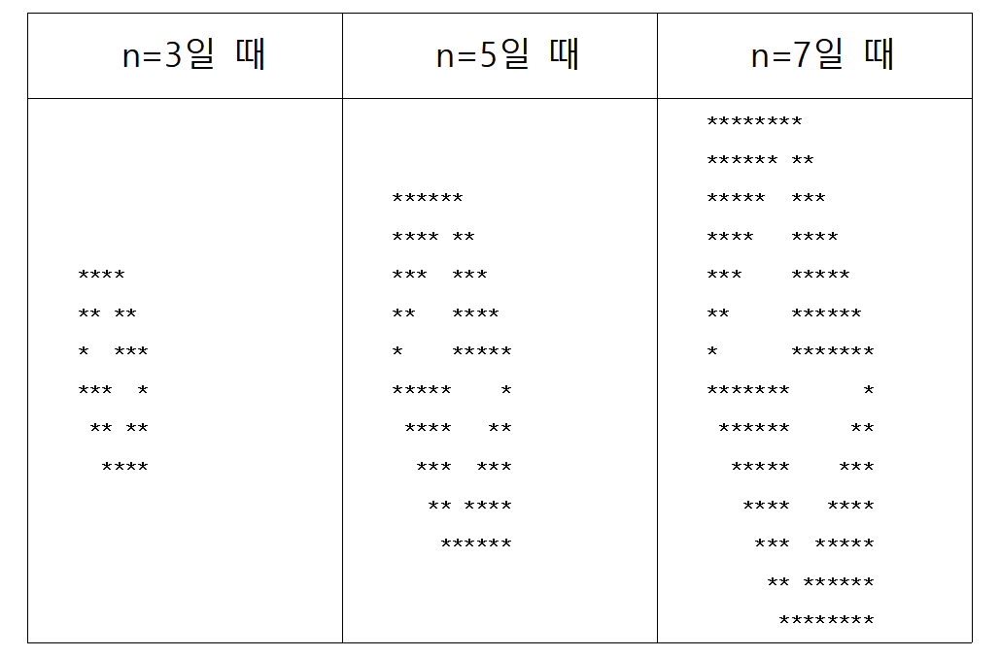

# C작점 6주차 학습 일지

## 반복문 활용문제 : 별 모양 만들기

반복문을 활용한 출력제어의 연습을 위해 일명 ‘별 찍기 문제’를 만들어서 풀어보았다. 문제의 답의 출력형태는 간단한 모양의 별무늬 네 가지를 합친 모양으로 만들었다. 자연수 n을 입력받고, 한 변 길이가 n인 직각이등변삼각형을 아래 표와 같이 네 가지 방향으로 모두 나타내야 한다. 문제의 요점은 반복문을 잘 섞어 활용하여 별(“\*”)과 공백(“ ”)의 위치와 개수를 잘 조절해서 모양을 만들어내는 것이다. C언어의 printf() 함수에는 같은 것을 특정 횟수만큼 여러 번 반복해서 출력하는 기능이 없으므로, 가로 방향의 반복과 세로 방향의 반복을 위해 이중 반복문을 활용하여야 한다. 

이중 반복문은 반복문의 내부에 반복문이 있는 것으로, 지금 해결하려는 별 찍기 문제나, 배열의 정렬 알고리즘에서 많이 활용된다. 예를 들어 가로 4, 세로 3의 12개짜리 직사각형 별(“\*”)모양을 출력하기 위해서는 이중 반복문이 for(i=0; i<3; i++){ for(j=0; j<4; j++){ printf(“\*”); } printf(“\n”); } 와 같이 사용된다. 가장 바깥쪽 for문부터 살펴보도록 하자. 바깥쪽 for문은 지금 출력하는 행이 몇 번째 행인지 세리면서, 매 행의 끝에서 줄을 바꾸어주는 역할을 한다. 위의 예시에서 세로 방향으로 3개, 즉 출력이 3줄짜리이므로 i=0번째 줄부터 i=2번째 줄까지 3번 반복하며 내부의 for문을 실행하고 printf(“\n”); 으로 줄을 바꾼다. 이제 내부의 for문을 보자. 위의 예시에서 각 줄에 별(“\*”)을 4개씩 출력해야 하므로, for문으로 j가 0에서부터 3까지, 즉 4번 반복하여 출력한다. 이로써 4×3짜리 직사각형 모양의 별(“\*”)을 출력하였다.

다시 문제로 돌아와 보자. 예시에서 총 2n개의 줄에서 중간을 기준으로 모양의 규칙이 바뀌는 것을 알 수 있다. 따라서 위쪽 n개 줄의 출력을 마치고 나서 다른 코드로 나머지 아래쪽 n개 줄의 출력을 하도록 총 두 개의 이중 반복문을 만드는 것으로 문제를 해결할 수 있을 것으로 보인다.



먼저 위쪽 n개의 줄의 별 배치의 규칙성을 찾아보자. 가로 양쪽으로 총 2n개의 칸에 세로로 반을 잘라서 보면 왼쪽 칸은 왼쪽 정렬된 별이 n개에서 1개까지 감소하고, 오른쪽 칸은 왼쪽 정렬된 별이 1개에서 n개까지 증가하는 모양이다. 그러면 이제 줄별로 관찰해보자. i=0번째 줄에서는 별(‘\*’)이 n+1개 연속으로 출력이 되는데, 이는 별(‘\*’) n개, 공백(‘ ’) 0개, 별(‘\*’) 1개의 순서로 출력되었다고 볼 수 있다. i=1번째 줄에서는 별(‘\*’) n-1개, 공백(‘ ’) 1개, 별(‘\*’) 2개의 순서로 출력되었다. i=n-1번째 줄, 즉 마지막 줄에서는 별(‘\*’) 1개, 공백(‘ ’) n-1개, 별(‘\*’) n개의 순서로 출력되었다. 따라서 일반화하면, i번째 줄에서는 별(\‘*’) n-i개, 공백(‘ ’) i개, 별(‘\*’) i+1개의 순서로 출력된다.

다음으로 아래쪽 n개의 줄의 별 배치의 규칙성을 찾아보자. 가로 양쪽으로 총 2n개의 칸에 세로로 반을 잘라서 보면 왼쪽 칸은 오른쪽 정렬된 별이 n개에서 1개까지 감소하고, 오른쪽 칸은 오른쪽 정렬된 별이 1개에서 n개까지 증가하는 모양이다. 그러면 이제 줄별로 관찰해보자. i=0번째 줄에서는 별(‘\*’) n개, 공백(‘ ’) n-1개, 별(‘\*’) 1개의 순서로 출력되었는데, 이는 공백(‘ ’) 0개, 별(‘\*’) n개, 공백(‘ ’) n-1개, 별(‘\*’) 1개의 순서로 출력되었다고 볼 수 있다. i=1번째 줄에서는 공백(‘ ’) 1개, 별(‘\*’) n-1개, 공백(‘ ’) n-2개, 별(‘\*’) 2개의 순서로 출력되었다. i=n-1번째 줄, 즉 마지막 줄에서는 공백(‘ ’)이 n-1개, 별(‘\*’)이 n+1개 연속으로 출력이 되는데, 이는 공백(‘ ’) n-1개, 별(‘\*’) 1개, 공백(‘ ’) 0개, 별(‘\*’) n개의 순서로 출력되었다고 볼 수 있다. 따라서 일반화하면, i번째 줄에서는 공백(‘ ’) i개, 별(‘\*’) n-i개, 공백(‘ ’) n-i-1개, 별(‘\*’) i+1개의 순서로 출력된다.

이렇게 별의 배치 형태의 줄에 따른 변화 규칙을 찾아내면, 이중 반복문을 통해 코드를 쉽게 작성할 수 있다. 완성된 코드는 아래의 표와 같다. 반복문을 사용할 때, for(i=0; i<반복횟수; i++) 와 같은 형태로 작성하면 반복횟수가 눈에 보이게 확인되므로 효과적으로 반복문을 활용할 수 있다.

```c
#include <stdio.h>

int main(void)
{
    int n, i, j;
    
    scanf("%d", &n);
    
    for(i=0; i<n; i++){
        for(j=0; j<n-i; j++){
            printf("*");
        }
        for(j=0; j<i; j++){
            printf(" ");
        }
        for(j=0; j<i+1; j++){
            printf("*");
        }
        printf("\n");
    }
    
    for(i=0; i<n; i++){
        for(j=0; j<i; j++){
            printf(" ");
        }
        for(j=0; j<n-i; j++){
            printf("*");
        }
        for(j=0; j<n-i-1; j++){
            printf(" ");
        }
        for(j=0; j<i+1; j++){
            printf("*");
        }
        printf("\n");
    }
    
    return 0;
}
```


## 2. 구조체의 개념과 용법

‘구조체(structure)’라는 것은 하나 이상의 변수(포인터 변수, 배열 포함)를 묶어서 새로운 자료형을 정의하는 도구이다. 즉, 동일한 자료형을 묶어서 사용하는 배열처럼 다양한 자료형을 하나의 변수로 묶어 사용하는 것이다. 이를 가리켜 ‘사용자 정의 자료형(user defined data type)’이라고도 한다. 구조체의 키워드는 ‘struct’이다. 아래의 표에서 만든 구조체의 ‘student’는 구조체의 이름이다. 이 또한 식별자 작성규칙에 맞추어 작성해야 한다. 이 구조체를 함수 안에서 정의하면 해당 함수 안에서만 구조체를 사용할 수 있다는 점을 주의해야 한다. 

* 구조체의 정의

```c
struct student {
    char name[20];
    int id;
    int age;
};     
```

위는 이름(name)과 학번(id), 나이(age)의 정보를 가지는 student라는 구조체를 정의한 것이다. 구조체 중괄호 안에는 묶고자 하는 자료형들의 유형과 유형의 이름을 정의한다. 이를 멤버(Member)라 부른다. **마지막 중괄호 뒤에 꼭 세미콜론(;)을 적어주어야 한다.**

* 구조체 변수의 선언

```c
struct student {
    char name[20];
    int id;
    int age;
};     

int main()
{
    struct student st1;
    struct student st2;
    
    st1 = {"Kim", 2018111111, 20};
    
    st2.name = "Lee";
    st2.id = 2018222222;
    st2.age = 20;
    
    return 0;
}
```

위에서 정의한 student 구조체의 변수 st1, st2를 선언하여, 두가지 방법으로 초기화한 것이다. 구조체 변수를 선언할 때에는 **struct 구조체명 변수명;** 의 형태로 선언한다. 구조체를 초기화하는 방법은 st1에 적용한 것과 같이 {~, ~, ... , ~}의 형태로 한번에 초기화할 수도 있고, st2에 적용한 것과 같이 도트 연산자(.)를 통해 구조체의 각각의 멤버에 접근하여 하나씩 값을 저장해줄 수도 있다.

* 정의과 동시에 선언하기
```c
struct student {
    char name[20];
    int id;
    int age;
} st1;

st1 = {"Kim", 2018111111, 20};
```

student 구조체를 정의함과 동시에 student 변수 st1을 선언한 것이다. 정의과 선언을 동시에 하고 그 다음에 초기화시켰지만 아래와 같이 초기화까지 한번에 해줄 수 있다.

```c
struct student {
    char name[20];
    int id;
    int age;
} st1 = {"Kim", 2018111111, 20};
```

정의와 선언을 동시에 할 때는 구조체의 이름이 필수적이지 않다. 아래의 구조체 변수 st1은 위의 결과와 같다.

```C
struct {
    char name[20];
    int id;
    int age;
} st1 = {"Kim", 2018111111, 20};
```

* 구조체 변수의 복사 

st2=st1; 이라는 식은 st2.name = st1.name; st2.id = st1.id; st2.age = st1.age; 를 실행한 것과 같은 의미로서 str1에 해당하는 값들이 모두 str2에 동일한 값이 저장된다. 

* 구조체의 크기

구조체가 차지하는 메모리의 크기는 구조체 멤버 중 가장 크기가 큰 자료형의 배수로 결정된다. 위의 student 구조체의 멤버를 살펴보면 char형의 name[20]은 20바이트, int 형의 id는 4바이트, int 형의 age는 4바이트이다. 따라서 변수 st1의 크기는 int형의 크기 4바이트를 기준으로 student의 멤버변수들의 메모리 크기를 더한 값인 28byte가 된다. 이를 확인하기 위해 sizeof()함수를 사용하면 동일한 값이 나온다.

* 구조체의 재정의

typedef는 자료형을 재정의하는 키워드다. 이름이 긴 자료형을 재정의하면 좀 더 편리하게 변수를 선언할 수 있다. typedef를 이용하여 구조체의 자료형을 재정의하는 방법은 아래와 같이 구조체를 정의하고 **typedef struct 구조체명 재정의명;** 와 같이 재정의한다.

```c
struct students {
   char name[20];
   char address[30];
   int age;
};

typedef struct students student;                //자료형 재정의 : typedef struct 구조체명 재정의명;

student st1 = {“Moon”, “Seoul”, 25};            //재정의 이용 구조체 변수 선언

struct students st2 = {“John”, “London”, 30};   //재정의 이용x 구조체 변수 선언
```

여기에서는 struct students를 student로 재정의했다. 구조체 변수 선언할 때에 재정의명인 student를 이용해서 st1을 선언했고, 재정의를 사용하지 않고 struct students를 이용해서 st2를 선언했다. typedef를 이용할 때 다음과 같이 구조체명을 명시하지 않고 사용할 수 있다. 이렇게 사용할 때에는 **재정의명 변수명 ;** 형태로만 선언할 수 있다.

```c
typedef struct {
   char name[20];
   char address[30];
   int age;
} student;

student st1 = {“Moon”, “Seoul”, 25};   //반드시 다음과 같이 선언해야한다.
```

## 3. 포인터를 이용한 구조체 사용

일반변수 형태로 정의한 구조체의 멤버 변수에 접근할 때는 도트(.)연산자를 사용하는데, 포인터 변수 형태로 정의한 구조체의 멤버 변수에 접근할 때는 화살표(->)연산자를 이용한다.

* 도트연산자로 구조체 멤버 접근

```c
#include <stdio.h>

struct ThreeDime {
   int x;
   int y;
   int z;
};
typedef struct ThreeDime ThreeDime;

int main(void)
{
  ThreeDime A1 = {3,1,8};
  printf("3차원 점 A1의 x : %d, y : %d, z : %d이다.\n", A1.x, A1.y, A1.z);
  return 0;
}
```
* 구조체 포인터를 이용하여 구조체 멤버 접근

```c
#include <stdio.h>

struct ThreeDime {
   int x;
   int y;
   int z;
};
typedef struct ThreeDime ThreeDime;

int main (void)
{
  ThreeDime A1 = {3, 1, 8};
  ThreeDime *pA1 = &A1;
  printf("3차원 점 A1의 x : %d, y : %d, z : %d이다.\n", pA1->x, pA1->y, pA1->z);
  return 0;
}
```

위는 구조체 멤버 x, y, z를 지정하고 구조체형태로 A1을 저장하고 A1에 저장된 값을 도트연산자(.)로 확인하는 과정이다.
아래는 마찬가지로 멤버를 지정하고 구조체형태로 A1을 저장한 다음, point* pA1 = & A1;을 통해 pA1에는 A1의 주소를 저장했다. 그리고 pA1이 가리키는 주소의 값을 불러오기 위해서 포인터연산자(->)를 이용한 것이다.  이 둘의 결괏값은 같다.


도트연산자르 통해 멤버에 접근하는 방법과 구조체 포인터를 이용해 접근하는 방법을 모두 활용하는 간단한 프로그램을 만들어보자. 문제느 다음과 같다.

```
3차원 공간상의 두 점 A, B의 좌표를 입력받아 점 A와 원점 사이의 거리, 점 A와 점 B 사이의 거리, 점 A를 원점에 대해 대칭시킨 점을 출력하여라.
```

3차원 상의 점의 x, y, z성분을 멤버로 가지는 ThreeDime 구조체를 정의하고, 각각의 구하는 것을 함수로 만들어 호출하여 결과를 출력한다.

```
#include <stdio.h>
#include <math.h>

struct ThreeDime {
	double x;
	double y;
	double z;
};

typedef struct ThreeDime ThreeDime;

double Distance1(ThreeDime*a){
	double d;
	d = sqrt(a->x * a->x + a->y * a->y + a->z * a->z);
	return d;
}

double Distance2(ThreeDime*a, ThreeDime*b){
	double d;
	d = sqrt((a->x-b->x)*(a->x-b->x)+(a->y-b->y)*(a->y-b->y)+(a->z-b->z)*(a->z-b->z));
	return d;
}

ThreeDime SymOri(ThreeDime*a){
	a->x = -a->x;
	a->y = -a->y;
	a->z = -a->z;
	return *a;
}

int main(void)
{
	double dOA, dAB;
	ThreeDime A, B, C;
	
	printf("3차원 점 A의 x, y, z 좌표를 입력하시오 : ");
	scanf("%lf %lf %lf", &A.x, &A.y, &A.z);
	
	printf("3차원 점 B의 x, y, z 좌표를 입력하시오 : ");
	scanf("%lf %lf %lf", &B.x, &B.y, &B.z);
	
	dOA = Distance1(&A);
	
	dAB = Distance2(&A, &B);
	
	C = SymOri(&A);
	
	printf("\n점 A와 원점의 거리는 %.2lf이다.\n", dOA);
	printf("점 A와 점 B의 거리는 %.2lf이다.\n", dAB);
	printf("점 A을 원점에 대칭시킨 점은 x : %.2lf, y : %.2lf, z : %.2lf이다.\n", C.x, C.y, C.z); 
	
	return 0;
}
```


